# 安全运营架构图

```mermaid
%%{init: {'theme': 'dark', 'themeVariables': {
  'primaryColor': '#1e3a5f',
  'primaryTextColor': '#fff',
  'primaryBorderColor': '#00d4ff',
  'lineColor': '#8899a6',
  'secondaryColor': '#152238',
  'tertiaryColor': '#0d2035',
  'noteBkgColor': '#1a1a2e',
  'noteTextColor': '#fff',
  'noteBorderColor': '#ffc107',
  'signalColor': '#00d4ff',
  'signalTextColor': '#fff'
}, 'flowchart': {'curve': 'basis', 'nodeSpacing': 40, 'rankSpacing': 60, 'useMaxWidth': true}}}%%

flowchart TB

    %% ==================== 标题（不参与布局）====================
    TITLE["安全运营架构图"]

    %% ==================== 第一层：日志源 ====================
    subgraph LOG["🔴 ① 日志源层"]
        direction LR
        L1["🖥️ EDR终端"]
        L2["🛡️ WAF"]
        L3["🔥 防火墙"]
        L4["👤 AD域控"]
        L5["☁️ 云平台"]
        L6["📦 K8s"]
        L7["🌐 网络设备"]
        L8["🗄️ 数据库审计"]
    end

    %% ==================== 第二层：采集 ====================
    subgraph COL["🟠 ② 采集层"]
        C1["⚡ Vector Agent\n统一格式归一化"]
    end

    %% ==================== 第三层：SIEM ====================
    subgraph SIE["🟣 ③ SIEM 平台"]
        direction LR
        S1["🔧 归一化引擎"]
        S2["⚙️ 关联规则"]
        S3["🚦 告警分级\nP0·P1·P2"]
        S4["🔍 IOC检索"]
        S5["📈 UEBA"]
    end

    %% ==================== 第四层：SOAR ====================
    subgraph SOA["🔵 ④ SOAR 编排  Shuffle"]
        direction LR
        O1["📥 告警接收"]
        O2["🔁 去重聚合"]
        O3["📋 剧本编排"]
        O4["👆 人工审批"]
        O5["⚡ 自动执行"]
        O6["🤖 AI研判"]
    end

    %% ==================== 第五层：案件 ====================
    subgraph CAS["🟢 ⑤ 案件管理  TheHive"]
        direction LR
        T1["📝 工单创建"]
        T2["👥 调查分配"]
        T3["➡️ 状态流转"]
        T4["⏱️ SLA监控"]
        T5["📎 调查笔记"]
        T6["📊 指标统计"]
    end

    %% ==================== 第六层：指标 ====================
    subgraph MET["🟡 ⑥ 运营指标"]
        direction LR
        M1["⏱️ MTTD < 30min"]
        M2["⏱️ MTTR < 4h"]
        M3["📊 自动处置 > 30%"]
        M4["📊 闭环率 > 90%"]
        M5["🎯 误报率 < 40%"]
    end

    %% ==================== 第七层：情报 ====================
    subgraph INT["🟡 ⑦ 威胁情报"]
        direction LR
        I1["🌍 外部情报\nSTIX/TAXII"]
        I2["🏠 内部IOC\n自产共享"]
    end

    %% ==================== 数据流向 ====================
    LOG -->|"① 日志采集"| COL
    COL -->|"② 归一化"| SIE
    SIE -->|"③ 告警分发"| SOA
    SOA -->|"④ 工单创建"| CAS
    CAS -->|"⑤ 运营指标"| MET

    %% 执行指令
    SOA -.->|"封锁IP"| LOG
    SOA -.->|"隔离主机"| LOG
    SOA -.->|"禁用账号"| LOG

    %% 情报输入
    INT -->|"情报命中"| SIE

    %% 反馈
    CAS -.->|"误报反馈"| SIE

    %% ==================== 样式 ====================
    classDef title fill:#0a0a14,stroke:#00d4ff,color:#00d4ff,font-size:20
    classDef logSrc fill:#0d2035,stroke:#00d4ff,color:#fff,stroke-width:2px
    classDef collect fill:#1a1500,stroke:#ff9800,color:#fff,stroke-width:2px
    classDef siem fill:#1a0f2e,stroke:#9c27b0,color:#fff,stroke-width:2px
    classDef soar fill:#0a1520,stroke:#2196f3,color:#fff,stroke-width:2px
    classDef caseMgm fill:#0a2015,stroke:#00e676,color:#fff,stroke-width:2px
    classDef metrics fill:#1a1500,stroke:#ffc107,color:#ffc107,stroke-width:2px
    classDef intel fill:#1a1500,stroke:#ffc107,color:#fff,stroke-width:2px
    classDef action stroke:#e94560,stroke-width:2px
    classDef feed stroke:#ffc107,stroke-width:1.5px,stroke-dasharray:5
    classDef data stroke:#00d4ff,stroke-width:2px

    class TITLE title
    class L1,L2,L3,L4,L5,L6,L7,L8 logSrc
    class C1 collect
    class S1,S2,S3,S4,S5 siem
    class O1,O2,O3,O4,O5,O6 soar
    class T1,T2,T3,T4,T5,T6 caseMgm
    class M1,M2,M3,M4,M5 metrics
    class I1,I2 intel
```



---

## 数据流向

```
① 日志源层    EDR / WAF / 防火墙 / AD / 云平台 / K8s / 网络设备 / 数据库审计
        ↓
② 采集层      Vector Agent 统一采集归一化
        ↓
③ SIEM平台    归一化 → 关联规则 → 告警分级 → IOC检索 / UEBA
        ↓
④ SOAR编排    接收 → 去重 → 剧本 → 审批 → 自动执行 / AI研判
        ↓
⑤ 案件管理    工单创建 → 调查分配 → 状态流转 → SLA监控 / 调查笔记 → 指标统计
        ↓
⑥ 运营指标    MTTD / MTTR / 自动处置率 / 闭环率 / 误报率
```

## 配色

| 颜色 | 层级 |
|------|------|
| 🔴 | 日志源 |
| 🟠 | 采集 |
| 🟣 | SIEM |
| 🔵 | SOAR |
| 🟢 | 案件管理 |
| 🟡 | 指标 / 情报 |

> 复制到 [mermaid.live](https://mermaid.live) 预览
