# 安全运营架构图

```mermaid
%%{init: {'theme': 'dark', 'themeVariables': {
  'primaryColor': '#1e3a5f',
  'primaryTextColor': '#fff',
  'primaryBorderColor': '#00d4ff',
  'lineColor': '#8899a6',
  'secondaryColor': '#152238',
  'tertiaryColor': '#0d2035',
  'noteBkgColor': '#1a1a2e',
  'noteTextColor': '#fff',
  'noteBorderColor': '#ffc107',
  'actorBkg': '#1a1a2e',
  'actorBorder': '#00d4ff',
  'actorTextColor': '#fff',
  'signalColor': '#00d4ff',
  'signalTextColor': '#fff',
  'sectionBkgColor': '#0a0a14',
  'altSectionBkgColor': '#0a0a14'
}, 'flowchart': {'curve': 'basis', 'nodeSpacing': 50, 'rankSpacing': 80, 'useMaxWidth': true, 'rankSeparation': 100}}}%%

flowchart LR

    %% ==================== 第一列：日志源 ====================
    subgraph LOG["🔴 日志源层"]
        direction TB
        L1["🖥️ EDR终端\n青藤·360·火绒"]
        L2["🛡️ WAF\nWeb应用防火墙"]
        L3["🔥 防火墙\nFlow / NetFlow"]
        L4["👤 AD域控\n账户·登录事件"]
        L5["☁️ 云平台\n阿里云·华为云"]
        L6["📦 容器K8s\nAudit日志"]
        L7["🌐 网络设备\n交换机·路由器"]
        L8["🗄️ 数据库审计\nDAM"]
    end

    %% ==================== 第二列：采集 ====================
    subgraph COL["🟠 采集层"]
        direction TB
        C1["⚡ Vector Agent\n高性能日志采集\n统一格式归一化"]
    end

    %% ==================== 第三列：SIEM ====================
    subgraph SIE["🟣 SIEM平台"]
        direction TB
        S1["🔧 归一化引擎\n统一字段格式"]
        S2["⚙️ 关联规则\n多源→复合告警"]
        S3["🚦 告警分级\nP0·P1·P2·P3·P4"]
        S4["🔍 IOC检索\nIP·域名·Hash"]
        S5["📈 UEBA\n用户行为分析"]
    end

    %% ==================== 第四列：SOAR ====================
    subgraph SOA["🔵 SOAR编排\nShuffle"]
        direction TB
        O1["📥 告警接收\nWebhook·API"]
        O2["🔁 去重聚合\n同源·同事件"]
        O3["📋 剧本编排\n可视化·低代码"]
        O4["👆 人工审批\n钉钉·企微·邮件"]
        O5["⚡ 自动执行\n封锁·隔离·禁用"]
        O6["🤖 AI辅助\nPentAGI研判"]
    end

    %% ==================== 第五列：案件 ====================
    subgraph CAS["🟢 案件管理\nTheHive"]
        direction TB
        T1["📝 工单创建\n告警→自动建单"]
        T2["👥 调查分配\n类型·资产·负载"]
        T3["➡️ 状态流转\n调查→处置→闭环"]
        T4["⏱️ SLA监控\n超时预警·升级"]
        T5["📎 调查笔记\n附件·截图·日志"]
        T6["📊 指标统计\nMTTR·处置量"]
    end

    %% ==================== 第六列：指标 ====================
    subgraph MET["🟡 运营指标"]
        direction TB
        M1["⏱️ MTTD < 30min\n威胁检测时间"]
        M2["⏱️ MTTR < 4h\n响应处置时间"]
        M3["📊 自动处置 > 30%"]
        M4["📊 工单闭环 > 90%"]
        M5["🎯 误报率 < 40%"]
    end

    %% ==================== 第七列：情报 ====================
    subgraph INT["🟡 威胁情报"]
        direction TB
        I1["🌍 外部情报\nSTIX/TAXII"]
        I2["🏠 内部IOC\n自产·共享"]
    end

    %% ==================== 数据流 ====================

    LOG -->|"日志采集"| COL
    COL -->|"归一化"| SIE
    SIE -->|"分级触发"| SOA
    SOA -->|"工单生成"| CAS
    CAS -->|"指标更新"| MET

    %% 执行指令（虚线上方标注）
    SOA -->|"封锁IP"| LOG
    SOA -->|"隔离主机"| LOG
    SOA -->|"禁用账号"| LOG

    %% 情报输入
    INT -->|"情报命中"| SIE
    INT -.->|"规则优化"| SIE

    %% 误报反馈
    CAS -.->|"误报反馈"| SIE

    %% 情报回流
    INT <-.->|"IOC共享"| CAS

    %% ==================== 样式 ====================

    classDef logSrc fill:#0d2035,stroke:#00d4ff,color:#fff
    classDef collect fill:#1a1500,stroke:#ff9800,color:#fff
    classDef siem fill:#1a0f2e,stroke:#9c27b0,color:#fff
    classDef soar fill:#0a1520,stroke:#2196f3,color:#fff
    classDef caseMgm fill:#0a2015,stroke:#00e676,color:#fff
    classDef metrics fill:#1a1500,stroke:#ffc107,color:#ffc107
    classDef intel fill:#1a1500,stroke:#ffc107,color:#fff
    classDef actionLink stroke:#e94560,stroke-width:2,color:#e94560
    classDef dataLink stroke:#00d4ff,stroke-width:2,color:#00d4ff
    classDef feedLink stroke:#ffc107,stroke-width:1.5,stroke-dasharray:5,color:#ffc107

    class L1,L2,L3,L4,L5,L6,L7,L8 logSrc
    class C1 collect
    class S1,S2,S3,S4,S5 siem
    class O1,O2,O3,O4,O5,O6 soar
    class T1,T2,T3,T4,T5,T6 caseMgm
    class M1,M2,M3,M4,M5 metrics
    class I1,I2 intel
```

---

## 配色说明

| 颜色 | 层级 | 作用 |
|------|------|------|
| 🔴 蓝边框 | 日志源层 | 数据入口 |
| 🟠 橙边框 | 采集层 | 日志采集 |
| 🟣 紫边框 | SIEM平台 | 分析引擎 |
| 🔵 蓝边框 | SOAR编排 | 自动化响应 |
| 🟢 绿边框 | 案件管理 | 闭环管理 |
| 🟡 黄边框 | 指标/情报 | 输出/反馈 |

---

> 💡 复制上方代码到 [mermaid.live](https://mermaid.live) 可直接预览
