# 安全运营架构图

> 复制下方代码到 https://mermaid.live 预览

```mermaid
%%{init: {'theme': 'dark', 'themeVariables': {
  'primaryColor': '#1e3a5f',
  'primaryTextColor': '#fff',
  'primaryBorderColor': '#00d4ff',
  'lineColor': '#8899a6',
  'secondaryColor': '#152238',
  'tertiaryColor': '#0d2035',
  'signalColor': '#00d4ff',
  'signalTextColor': '#fff',
  'sectionBkgColor': '#0a0a14'
}, 'flowchart': {'curve': 'basis', 'nodeSpacing': 60, 'rankSpacing': 80, 'useMaxWidth': true}}}%%

flowchart TB
    %% ===== 第1层：日志源 =====
    subgraph LOG["🔴 ① 日志源层"]
        direction LR
        L1["🖥️ EDR终端"]
        L2["🛡️ WAF"]
        L3["🔥 防火墙"]
        L4["👤 AD域控"]
        L5["☁️ 云平台"]
        L6["📦 K8s"]
        L7["🌐 网络设备"]
        L8["🗄️ DAM"]
    end

    %% ===== 第2层：采集 =====
    C1["⚡ Vector Agent"]

    %% ===== 第3层：SIEM =====
    subgraph SIE["🟣 ③ SIEM平台"]
        direction LR
        S1["🔧 归一化"]
        S2["⚙️ 关联规则"]
        S3["🚦 告警分级"]
        S4["🔍 IOC检索"]
        S5["📈 UEBA"]
    end

    %% ===== 第4层：SOAR =====
    subgraph SOA["🔵 ④ SOAR 编排"]
        direction LR
        O1["📥 接收"]
        O2["🔁 去重"]
        O3["📋 剧本"]
        O4["👆 审批"]
        O5["⚡ 执行"]
        O6["🤖 AI"]
    end

    %% ===== 第5层：案件 =====
    subgraph CAS["🟢 ⑤ 案件管理"]
        direction LR
        T1["📝 建单"]
        T2["👥 分配"]
        T3["➡️ 流转"]
        T4["⏱️ SLA"]
        T5["📎 笔记"]
        T6["📊 统计"]
    end

    %% ===== 第6层：指标 =====
    subgraph MET["🟡 ⑥ 运营指标"]
        direction LR
        M1["⏱️ MTTD\n<30min"]
        M2["⏱️ MTTR\n<4h"]
        M3["📊 自动\n>30%"]
        M4["📊 闭环\n>90%"]
        M5["🎯 误报\n<40%"]
    end

    %% ===== 第7层：情报 =====
    subgraph INT["🟡 ⑦ 威胁情报"]
        direction LR
        I1["🌍 外部\nSTIX/TAXII"]
        I2["🏠 内部\nIOC"]
    end

    %% ===== 数据流 =====
    LOG -->|"① 日志采集"| C1
    C1 -->|"② 归一化"| SIE
    SIE -->|"③ 告警分发"| SOA
    SOA -->|"④ 工单创建"| CAS
    CAS -->|"⑤ 指标汇总"| MET
    INT -.->|"情报命中"| SIE
    CAS -.->|"误报反馈"| SIE
    SOA -.->|"封锁"| LOG
    SOA -.->|"隔离"| LOG
    SOA -.->|"禁用"| LOG

    %% ===== 样式 =====
    classDef logSrc fill:#0d2035,stroke:#00d4ff,color:#fff,stroke-width:2px
    classDef collect fill:#1a1500,stroke:#ff9800,color:#ff9800,stroke-width:2px
    classDef siem fill:#1a0f2e,stroke:#9c27b0,color:#fff,stroke-width:2px
    classDef soar fill:#0a1520,stroke:#2196f3,color:#fff,stroke-width:2px
    classDef caseMgm fill:#0a2015,stroke:#00e676,color:#fff,stroke-width:2px
    classDef metrics fill:#1a1500,stroke:#ffc107,color:#ffc107,stroke-width:2px
    classDef intel fill:#1a1500,stroke:#ffc107,color:#fff,stroke-width:2px
    classDef action stroke:#e94560,stroke-width:2px
    classDef feed stroke:#ffc107,stroke-width:1.5px,stroke-dasharray:5
    classDef data stroke:#00d4ff,stroke-width:2px

    class L1,L2,L3,L4,L5,L6,L7,L8 logSrc
    class C1 collect
    class S1,S2,S3,S4,S5 siem
    class O1,O2,O3,O4,O5,O6 soar
    class T1,T2,T3,T4,T5,T6 caseMgm
    class M1,M2,M3,M4,M5 metrics
    class I1,I2 intel
```



---

**布局说明**

```
🔴 ① 日志源    [EDR] [WAF] [防火墙] [AD] [云平台] [K8s] [网络] [DAM]
          ↓
🟠 ② 采集      [Vector Agent]
          ↓
🟣 ③ SIEM     [归一化] [关联规则] [告警分级] [IOC检索] [UEBA]
          ↓
🔵 ④ SOAR     [接收] [去重] [剧本] [审批] [执行] [AI]
          ↓
🟢 ⑤ 案件     [建单] [分配] [流转] [SLA] [笔记] [统计]
          ↓
🟡 ⑥ 指标     [MTTD] [MTTR] [自动处置] [闭环率] [误报]
          ↓
🟡 ⑦ 情报     [外部STIX] [内部IOC]
```

**配色**

| 颜色 | 层级 |
|------|------|
| 🔴 蓝 | 日志源 |
| 🟠 橙 | 采集 |
| 🟣 紫 | SIEM |
| 🔵 蓝 | SOAR |
| 🟢 绿 | 案件管理 |
| 🟡 黄 | 指标 / 情报 |

> 💡 复制代码到 [mermaid.live](https://mermaid.live) 即可预览
