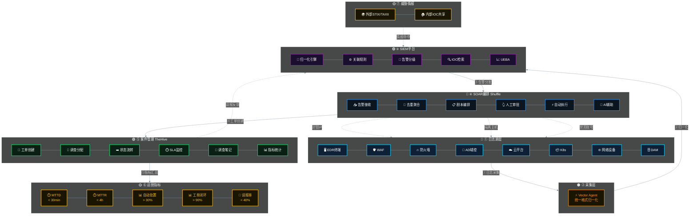

```mermaid
%%{init: {'theme': 'dark', 'themeVariables': {
  'primaryColor': '#1e3a5f',
  'primaryTextColor': '#fff',
  'primaryBorderColor': '#00d4ff',
  'lineColor': '#8899a6',
  'secondaryColor': '#152238',
  'tertiaryColor': '#0d2035',
  'signalColor': '#00d4ff',
  'signalTextColor': '#fff'
}, 'flowchart': {'curve': 'basis', 'nodeSpacing': 50, 'rankSpacing': 70, 'useMaxWidth': true}}}%%

flowchart TB
    %% ===== 第1层：日志源（最顶层）=====
    subgraph LOG["🔴 ① 日志源层"]
        direction LR
        L1["🖥️ EDR终端"] --- L2["🛡️ WAF"] --- L3["🔥 防火墙"] --- L4["👤 AD域控"] --- L5["☁️ 云平台"] --- L6["📦 K8s"] --- L7["🌐 网络设备"] --- L8["🗄️ DAM"]
    end

    %% ===== 第2层：采集 =====
    subgraph COL["🟠 ② 采集层"]
        C1["⚡ Vector Agent\n统一格式归一化"]
    end

    %% ===== 第3层：SIEM =====
    subgraph SIE["🟣 ③ SIEM平台"]
        direction LR
        S1["🔧 归一化引擎"] --- S2["⚙️ 关联规则"] --- S3["🚦 告警分级"] --- S4["🔍 IOC检索"] --- S5["📈 UEBA"]
    end

    %% ===== 第4层：SOAR =====
    subgraph SOA["🔵 ④ SOAR编排  Shuffle"]
        direction LR
        O1["📥 告警接收"] --- O2["🔁 去重聚合"] --- O3["📋 剧本编排"] --- O4["👆 人工审批"] --- O5["⚡ 自动执行"] --- O6["🤖 AI辅助"]
    end

    %% ===== 第5层：案件管理 =====
    subgraph CAS["🟢 ⑤ 案件管理  TheHive"]
        direction LR
        T1["📝 工单创建"] --- T2["👥 调查分配"] --- T3["➡️ 状态流转"] --- T4["⏱️ SLA监控"] --- T5["📎 调查笔记"] --- T6["📊 指标统计"]
    end

    %% ===== 第6层：运营指标 =====
    subgraph MET["🟡 ⑥ 运营指标"]
        direction LR
        M1["⏱️ MTTD\n< 30min"] --- M2["⏱️ MTTR\n< 4h"] --- M3["📊 自动处置\n> 30%"] --- M4["📊 工单闭环\n> 90%"] --- M5["🎯 误报率\n< 40%"]
    end

    %% ===== 第7层：威胁情报 =====
    subgraph INT["🟡 ⑦ 威胁情报"]
        direction LR
        I1["🌍 外部STIX/TAXII"] --- I2["🏠 内部IOC共享"]
    end

    %% ===== 数据流向（从上到下）=====
    LOG -->|"①日志采集"| COL
    COL -->|"②归一化"| SIE
    SIE -->|"③告警分发"| SOA
    SOA -->|"④工单创建"| CAS
    CAS -->|"⑤指标汇总"| MET

    %% ===== 情报与反馈（虚线）=====
    INT -.->|"情报命中"| SIE
    CAS -.->|"误报反馈"| SIE

    %% ===== 执行指令（虚线向上）=====
    SOA -.->|"封锁IP"| LOG
    SOA -.->|"隔离主机"| LOG
    SOA -.->|"禁用账号"| LOG

    %% ===== 样式 =====
    classDef logSrc fill:#0d2035,stroke:#00d4ff,color:#fff,stroke-width:2px
    classDef collect fill:#1a1500,stroke:#ff9800,color:#ff9800,stroke-width:2px
    classDef siem fill:#1a0f2e,stroke:#9c27b0,color:#fff,stroke-width:2px
    classDef soar fill:#0a1520,stroke:#2196f3,color:#fff,stroke-width:2px
    classDef caseMgm fill:#0a2015,stroke:#00e676,color:#fff,stroke-width:2px
    classDef metrics fill:#1a1500,stroke:#ffc107,color:#ffc107,stroke-width:2px
    classDef intel fill:#1a1500,stroke:#ffc107,color:#fff,stroke-width:2px

    class L1,L2,L3,L4,L5,L6,L7,L8 logSrc
    class C1 collect
    class S1,S2,S3,S4,S5 siem
    class O1,O2,O3,O4,O5,O6 soar
    class T1,T2,T3,T4,T5,T6 caseMgm
    class M1,M2,M3,M4,M5 metrics
    class I1,I2 intel
```
