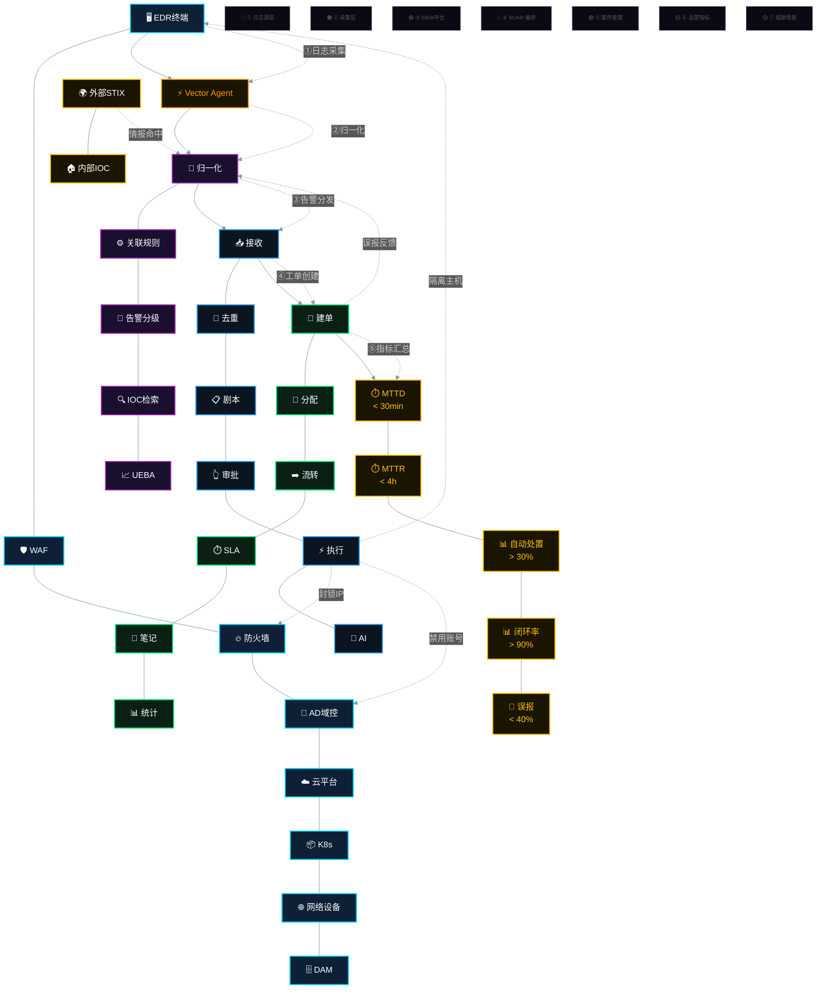

```mermaid
%%{init: {'theme': 'dark', 'themeVariables': {
  'primaryColor': '#1e3a5f',
  'primaryTextColor': '#fff',
  'primaryBorderColor': '#00d4ff',
  'lineColor': '#8899a6',
  'signalColor': '#00d4ff',
  'signalTextColor': '#fff',
  'sectionBkgColor': '#0a0a14'
}, 'flowchart': {'curve': 'basis', 'nodeSpacing': 40, 'rankSpacing': 65, 'useMaxWidth': true}}}%%

flowchart TB
    %% ===== 顶层：日志源（Rank 1）=====
    L1["🖥️ EDR终端"] --- L2["🛡️ WAF"] --- L3["🔥 防火墙"] --- L4["👤 AD域控"] --- L5["☁️ 云平台"] --- L6["📦 K8s"] --- L7["🌐 网络设备"] --- L8["🗄️ DAM"]
    LOG_LABEL["🔴 ① 日志源层"]

    %% ===== Rank 2：采集 =====
    C1["⚡ Vector Agent"]
    COL_LABEL["🟠 ② 采集层"]

    %% ===== Rank 3：SIEM =====
    S1["🔧 归一化"] --- S2["⚙️ 关联规则"] --- S3["🚦 告警分级"] --- S4["🔍 IOC检索"] --- S5["📈 UEBA"]
    SIE_LABEL["🟣 ③ SIEM平台"]

    %% ===== Rank 4：SOAR =====
    O1["📥 接收"] --- O2["🔁 去重"] --- O3["📋 剧本"] --- O4["👆 审批"] --- O5["⚡ 执行"] --- O6["🤖 AI"]
    SOA_LABEL["🔵 ④ SOAR 编排"]

    %% ===== Rank 5：案件 =====
    T1["📝 建单"] --- T2["👥 分配"] --- T3["➡️ 流转"] --- T4["⏱️ SLA"] --- T5["📎 笔记"] --- T6["📊 统计"]
    CAS_LABEL["🟢 ⑤ 案件管理"]

    %% ===== Rank 6：指标 =====
    M1["⏱️ MTTD\n< 30min"] --- M2["⏱️ MTTR\n< 4h"] --- M3["📊 自动处置\n> 30%"] --- M4["📊 闭环率\n> 90%"] --- M5["🎯 误报\n< 40%"]
    MET_LABEL["🟡 ⑥ 运营指标"]

    %% ===== 情报（接入SIEM，不占主流程rank）=====
    I1["🌍 外部STIX"] --- I2["🏠 内部IOC"]
    INT_LABEL["🟡 ⑦ 威胁情报"]

    %% ===== 强制 rank 顺序 =====
    L1 --> C1
    C1 --> S1
    S1 --> O1
    O1 --> T1
    T1 --> M1

    %% ===== 数据流标注 =====
    L1 -.->|"①日志采集"| C1
    C1 -.->|"②归一化"| S1
    S1 -.->|"③告警分发"| O1
    O1 -.->|"④工单创建"| T1
    T1 -.->|"⑤指标汇总"| M1

    %% ===== 情报流入 =====
    I1 -.->|"情报命中"| S1

    %% ===== 执行指令向上 =====
    O5 -.->|"封锁IP"| L3
    O5 -.->|"隔离主机"| L1
    O5 -.->|"禁用账号"| L4

    %% ===== 误报反馈 =====
    T1 -.->|"误报反馈"| S1

    %% ===== 样式 =====
    classDef layerLabel fill:#0a0a14,stroke:#334,color:#556,font-size:10
    classDef logSrc fill:#0d2035,stroke:#00d4ff,color:#fff,stroke-width:2px
    classDef collect fill:#1a1500,stroke:#ff9800,color:#ff9800,stroke-width:2px
    classDef siem fill:#1a0f2e,stroke:#9c27b0,color:#fff,stroke-width:2px
    classDef soar fill:#0a1520,stroke:#2196f3,color:#fff,stroke-width:2px
    classDef caseMgm fill:#0a2015,stroke:#00e676,color:#fff,stroke-width:2px
    classDef metrics fill:#1a1500,stroke:#ffc107,color:#ffc107,stroke-width:2px
    classDef intel fill:#1a1500,stroke:#ffc107,color:#fff,stroke-width:2px

    class LOG_LABEL,COL_LABEL,SIE_LABEL,SOA_LABEL,CAS_LABEL,MET_LABEL,INT_LABEL layerLabel
    class L1,L2,L3,L4,L5,L6,L7,L8 logSrc
    class C1 collect
    class S1,S2,S3,S4,S5 siem
    class O1,O2,O3,O4,O5,O6 soar
    class T1,T2,T3,T4,T5,T6 caseMgm
    class M1,M2,M3,M4,M5 metrics
    class I1,I2 intel
```
