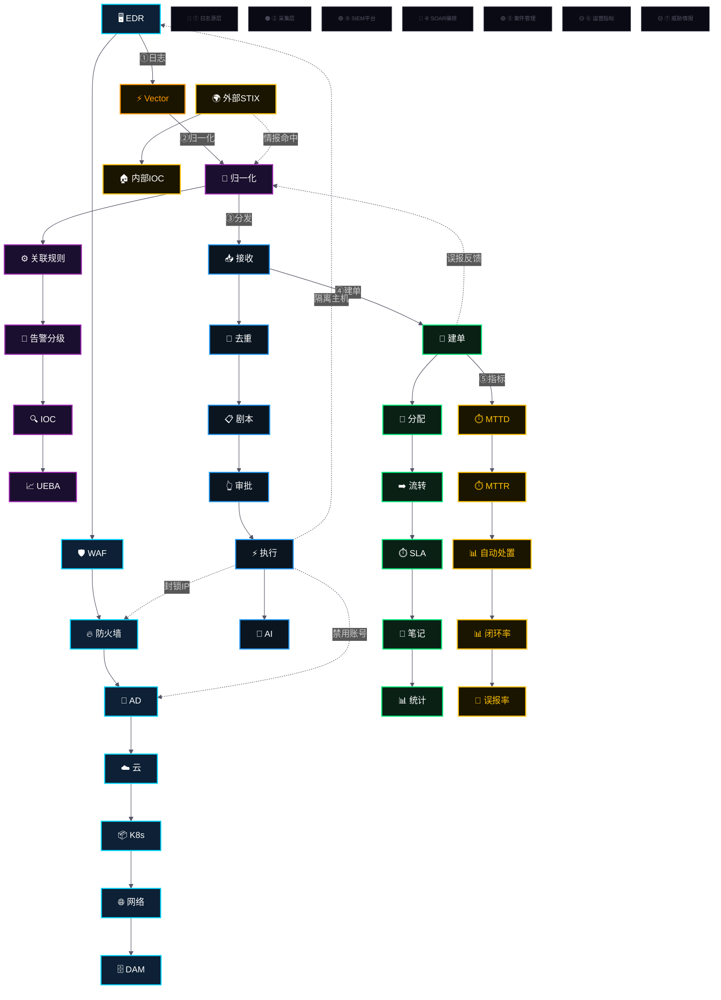

```mermaid
%%{init: {'theme': 'dark', 'themeVariables': {
  'primaryColor': '#1e3a5f',
  'primaryTextColor': '#fff',
  'primaryBorderColor': '#00d4ff',
  'lineColor': '#556',
  'signalColor': '#00d4ff',
  'signalTextColor': '#fff'
}, 'flowchart': {'curve': 'basis', 'nodeSpacing': 20, 'rankSpacing': 70, 'useMaxWidth': true, 'rankSeparation': 80}}}%%

flowchart TB
    %% === 强制每层 rank：每层第一个节点用 --> 连接，形成自上而下的主链 ===
    %% Rank 1：日志源
    L1a["🖥️ EDR"] --> L1b["🛡️ WAF"] --> L1c["🔥 防火墙"] --> L1d["👤 AD"] --> L1e["☁️ 云"] --> L1f["📦 K8s"] --> L1g["🌐 网络"] --> L1h["🗄️ DAM"]
    L1a -->|"①日志"| L2a

    %% Rank 2：采集
    L2a["⚡ Vector"] -->|"②归一化"| L3a

    %% Rank 3：SIEM
    L3a["🔧 归一化"] --> L3b["⚙️ 关联规则"] --> L3c["🚦 告警分级"] --> L3d["🔍 IOC"] --> L3e["📈 UEBA"]
    L3a -->|"③分发"| L4a

    %% Rank 4：SOAR
    L4a["📥 接收"] --> L4b["🔁 去重"] --> L4c["📋 剧本"] --> L4d["👆 审批"] --> L4e["⚡ 执行"] --> L4f["🤖 AI"]
    L4a -->|"④建单"| L5a

    %% Rank 5：案件
    L5a["📝 建单"] --> L5b["👥 分配"] --> L5c["➡️ 流转"] --> L5d["⏱️ SLA"] --> L5e["📎 笔记"] --> L5f["📊 统计"]
    L5a -->|"⑤指标"| L6a

    %% Rank 6：指标
    L6a["⏱️ MTTD"] --> L6b["⏱️ MTTR"] --> L6c["📊 自动处置"] --> L6d["📊 闭环率"] --> L6e["🎯 误报率"]

    %% Rank 7：情报（不占主流程 rank，通过虚线连接）
    L7a["🌍 外部STIX"] --> L7b["🏠 内部IOC"]
    L7a -.->|"情报命中"| L3a

    %% SOAR 执行指令向上
    L4e -.->|"封锁IP"| L1c
    L4e -.->|"隔离主机"| L1a
    L4e -.->|"禁用账号"| L1d

    %% 误报反馈
    L5a -.->|"误报反馈"| L3a

    %% === 层级标签（用 shape 区分，不参与 rank）===
    LOG["🔴 ① 日志源层"]
    COL["🟠 ② 采集层"]
    SIE["🟣 ③ SIEM平台"]
    SOA["🔵 ④ SOAR编排"]
    CAS["🟢 ⑤ 案件管理"]
    MET["🟡 ⑥ 运营指标"]
    INT["🟡 ⑦ 威胁情报"]

    classDef layerLabel fill:#0a0a14,stroke:#334,color:#556,font-size:10
    classDef logSrc fill:#0d2035,stroke:#00d4ff,color:#fff,stroke-width:2px
    classDef collect fill:#1a1500,stroke:#ff9800,color:#ff9800,stroke-width:2px
    classDef siem fill:#1a0f2e,stroke:#9c27b0,color:#fff,stroke-width:2px
    classDef soar fill:#0a1520,stroke:#2196f3,color:#fff,stroke-width:2px
    classDef caseMgm fill:#0a2015,stroke:#00e676,color:#fff,stroke-width:2px
    classDef metrics fill:#1a1500,stroke:#ffc107,color:#ffc107,stroke-width:2px
    classDef intel fill:#1a1500,stroke:#ffc107,color:#fff,stroke-width:2px

    class LOG,COL,SIE,SOA,CAS,MET,INT layerLabel
    class L1a,L1b,L1c,L1d,L1e,L1f,L1g,L1h logSrc
    class L2a collect
    class L3a,L3b,L3c,L3d,L3e siem
    class L4a,L4b,L4c,L4d,L4e,L4f soar
    class L5a,L5b,L5c,L5d,L5e,L5f caseMgm
    class L6a,L6b,L6c,L6d,L6e metrics
    class L7a,L7b intel
```
