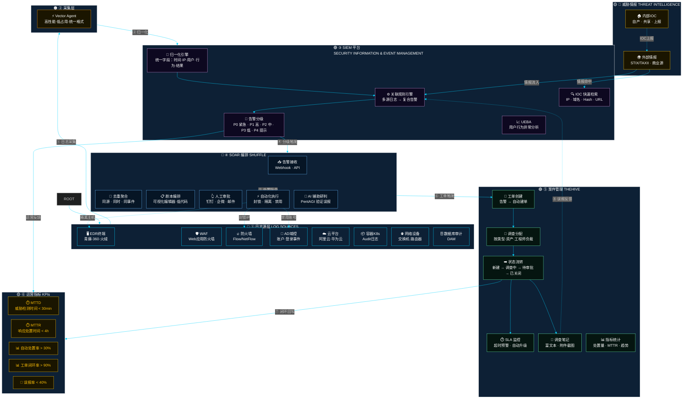

# 安全运营架构图（Mermaid 版本）

> 可粘贴到 [Mermaid Live Editor](https://mermaid.live) 或支持 Mermaid 的编辑器（GitHub README、Notion、飞书等）



---

## 数据流说明

```
① 日志产生          各安全设备/系统产生原始日志
        ↓
② 采集归一化        Vector Agent 采集 → 统一字段格式
        ↓
③ 关联分析          SIEM 规则引擎 → 多源日志 → 复合告警
        ↓
④ 告警分级          P0/P1/P2/P3/P4 分级
        ↓
⑤ SOAR 研判        接收 → 去重 → 剧本 → 审批/执行 → AI辅助
        ↓                ↓
⑥ 工单创建          自动从告警生成 TheHive 工单
        ↓
⑦ 调查闭环          分配 → 处置 → 验证 → 关闭
        ↓
⑧ 指标统计          MTTD / MTTR / 处置率 / 闭环率
```

---

## 配色说明

| 颜色 | 层级 | 说明 |
|------|------|------|
| 🔴 红色边框 | 日志源层 | 蓝色系企业安全基础 |
| 🟠 橙色边框 | 采集层 | 高性能日志采集 |
| 🟣 紫色边框 | SIEM 平台 | 核心分析能力 |
| 🔵 蓝色边框 | SOAR 编排 | 自动化响应 |
| 🟢 绿色边框 | 案件管理 | 闭环管理 |
| 🟡 黄色 | 威胁情报 + 指标 | 输入/输出 |

---

> 💡 **提示**：直接复制上方 Mermaid 代码粘贴到 [mermaid.live](https://mermaid.live) 可实时预览和调整。
