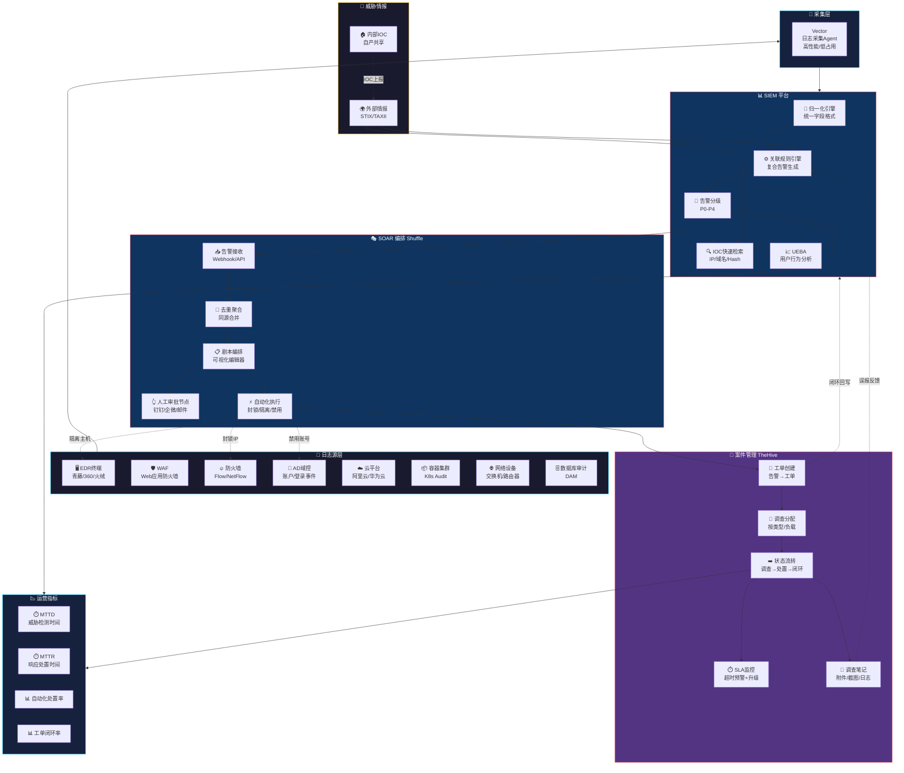

# 安全运营架构图



---

## 数据流向说明

```
① 日志产生
   └─ 各安全设备/系统产生原始日志

② 采集归一化
   └─ Vector Agent 采集 → 统一字段格式（时间/IP/用户/行为/结果）

③ 关联分析
   └─ SIEM 规则引擎 → 多源日志关联 → 生成复合告警

④ 告警分级
   └─ P0（紧急）/ P1（高）/ P2（中）/ P3（低）/ P4（提示）

⑤ SOAR 研判
   ├─ 低置信度 → 标记误报 → 回写 SIEM 规则优化
   ├─ 中置信度 → 创建 TheHive 工单 → 分析师调查
   └─ 高置信度 → 自动处置（封锁/隔离/禁用）→ 人工审批后执行

⑥ 案件管理
   └─ 调查 → 处置 → 验证 → 闭环 → 运营指标统计

⑦ 情报驱动
   └─ 外部情报输入 + 内部 IOC 输出共享
```
